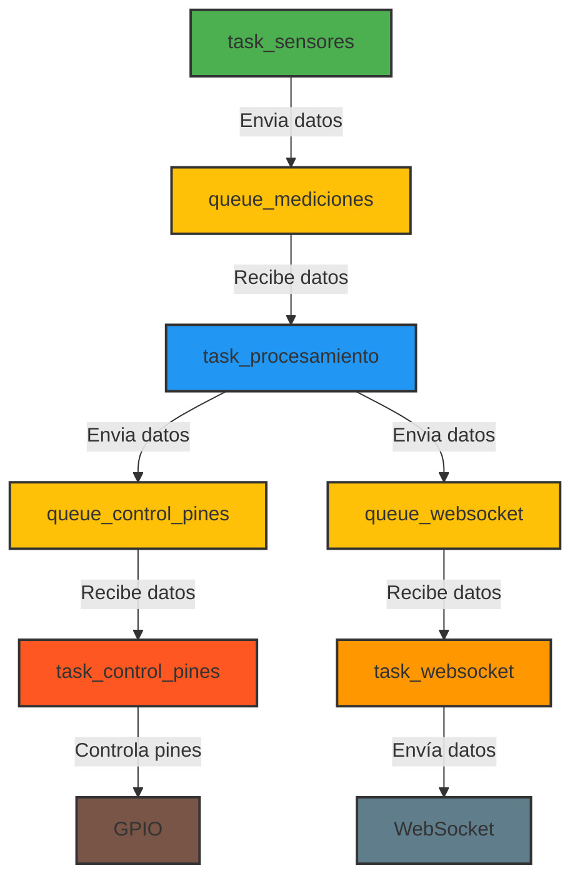

# 📌 Arquitectura FreeRTOS para Sensores y Control de Pines en ESP

## **1. Descripción del Problema**
Tienes un sistema basado en **FreeRTOS** en un **ESP de Espressif** que debe:

✅ Leer datos de **4 sensores**:
   - **2 sensores de humedad y temperatura** del ambiente.
   - **2 sensores de humedad del suelo**.
✅ Enviar los 4 datos a una **cola única**.
✅ Llamar a **diferentes tareas** para:
   - Validar y tomar decisiones sobre los pines de salida.
   - Enviar datos a través de **WebSockets**.
✅ Evitar problemas de **concurrencia** con la cola.

## **2. Solución: Arquitectura basada en Productor-Consumidor**
### 🟢 **Tareas principales**
1. **`task_sensores`** → Lee los 4 sensores y envía los datos a `queue_mediciones`.
2. **`task_procesamiento`** → Recibe datos de la cola y los distribuye a otras tareas.
3. **`task_control_pines`** → Decide si encender/apagar pines según la humedad del suelo.
4. **`task_websocket`** → Envía datos validados a través de WebSockets.

## **3. Diagrama de Flujo en Mermaid**


## **4. Implementación en FreeRTOS**

### **📌 Definición de colas**
```c
QueueHandle_t queue_mediciones;
QueueHandle_t queue_control_pines;
QueueHandle_t queue_websocket;
```

### **📌 Estructura de datos**
```c
typedef struct {
    float temp1, hum1;
    float temp2, hum2;
    int humedad_suelo1, humedad_suelo2;
} SensoresData;
```

### **📌 Task de lectura de sensores**
```c
void task_sensores(void *pvParameters) {
    SensoresData datos;
    while (1) {
        // Leer sensores
        datos.temp1 = leer_temp_sensor1();
        datos.hum1 = leer_hum_sensor1();
        datos.temp2 = leer_temp_sensor2();
        datos.hum2 = leer_hum_sensor2();
        datos.humedad_suelo1 = leer_humedad_suelo1();
        datos.humedad_suelo2 = leer_humedad_suelo2();

        // Enviar datos a la cola
        xQueueSend(queue_mediciones, &datos, portMAX_DELAY);

        // Esperar intervalo de muestreo
        vTaskDelay(pdMS_TO_TICKS(1000)); // 1 segundo
    }
}
```

### **📌 Task de procesamiento**
```c
void task_procesamiento(void *pvParameters) {
    SensoresData datos;
    while (1) {
        // Recibe datos desde la cola
        if (xQueueReceive(queue_mediciones, &datos, portMAX_DELAY)) {
            // Lógica de validación y decisión
            if (datos.humedad_suelo1 < 30 || datos.humedad_suelo2 < 30) {
                xQueueSend(queue_control_pines, &datos, portMAX_DELAY);
            }
            xQueueSend(queue_websocket, &datos, portMAX_DELAY);
        }
    }
}
```

### **📌 Task de control de pines**
```c
void task_control_pines(void *pvParameters) {
    SensoresData datos;
    while (1) {
        if (xQueueReceive(queue_control_pines, &datos, portMAX_DELAY)) {
            if (datos.humedad_suelo1 < 30) {
                encender_bomba_agua1();
            }
            if (datos.humedad_suelo2 < 30) {
                encender_bomba_agua2();
            }
        }
    }
}
```

### **📌 Task de WebSocket**
```c
void task_websocket(void *pvParameters) {
    SensoresData datos;
    while (1) {
        if (xQueueReceive(queue_websocket, &datos, portMAX_DELAY)) {
            enviar_datos_por_websocket(datos);
        }
    }
}
```

## **5. Conclusión**
Esta arquitectura soluciona:
✅ **Concurrencia**: Solo `task_sensores` escribe en `queue_mediciones`.
✅ **Escalabilidad**: Puedes agregar más tareas sin afectar la estructura.
✅ **Eficiencia**: Usa colas separadas para evitar bloqueos innecesarios.

Si necesitas más optimización, puedes implementar **event groups** para coordinar eventos entre tareas o usar **timers** para ejecución periódica.

🚀 ¿Necesitas más ajustes o mejoras?

